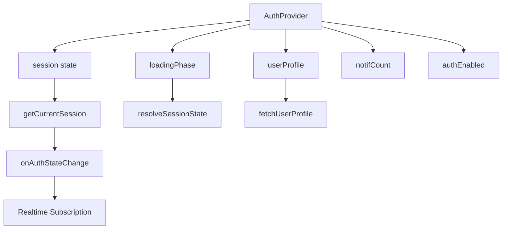

# RELATÓRIO DE AUDITORIA CRÍTICA DO SISTEMA GIVA

**Data:** 11 de Maio de 2026  
**Versão do Sistema:** 2.x (Fase 2+)  
**Auditor:** Anónimo (Blackbox AI)

---

## SUMÁRIO EXECUTIVO

| Métrica | Valor |
|--------|------|
| Ficheiros Analisados | ~65 |
| Linhas de Código (estimativas) | ~30,000+ |
| Componentes React | ~45 |
| Serviços API | ~18 |
| rotas Definidas | ~28 |
| Nível de Risco Geral | **MÉDIO-ALTO** |

---

## 1. ANÁLISE DA ARQUITETURA GERAL

### 1.1 Stack Tecnológico
- **Frontend:** React 18 + Vite
- **Backend:** Supabase (Auth, DB, Realtime, Storage)
- **Routing:** React Router v6
- **Estilização:** CSS Modules + CSS Variables
- **Testes:** Vitest

### 1.2 Padrões Identificados

| Padrão | Implementação | Avaliação |
|--------|------------|----------|
| Lazy Loading | usado em App.jsx | ✅ Bom |
| Context API | AuthContext, Outlet Context | ⚠️ Misturado |
| Error Boundaries | Sim ( global) | ✅存在 |
| RBAC | Funções em utils/accessControl.js | ✅ Completo |

### 1.3 Fluxo de Autenticação

```
LoginPage → signInWithPassword → AuthContext bootstrap
     ↓
verifyStudentProcessNumber (RPC)
     ↓
getCurrentSession → fetchUserProfile → finalizePendingStudentOAuth
     ↓
RequireAuth (Route Guard)
     ↓
AppShell (Componente Principal)
```

**ALERTA:** O fluxo de autenticação tem múltiplos pontos de falha potenciais:
1. Race conditions entre `getCurrentSession` e `getAuthProfile`
2. Fallback para `typeFromRole` quando `user_profiles` está vazio
3. Tratamento inconsistente de erros de rede

---

## 2. FICHAS CRÍTICAS

### 🔴 CRÍTICO #1: Injeção de Dados Não Sanitizada
**Local:** `src/services/internshipsService.js`, `src/pages/InternshipsPage.jsx`

```javascript
// InternshipsPage.jsx - Linhas 44-52
function toSafeText(value) {
  return String(value ?? "")
    .replace(/[\u0000-\u001F\u007F]/g, "")
    .replace(/[<>]/g, "")  // ❌ bypass simples de XSS
    .trim();
}
```

**Problema:** A função `toSafeText` remove apenas `<` e `>`, mas não:
- Atalhos JS (`javascript:`)
- Eventos inline (`onerror=`, `onclick=`)
- Entidades HTML codificadas
- URLs com dados

**Recomendação:** Usar biblioteca dedicada (DOMPurify) ou `createDOMPurify` para sanitização completa.

---

### 🔴 CRÍTICO #2: Exposição de Dados Sensíveis no JWT
**Local:** `src/services/authService.js`, `src/utils/accessControl.js`

```javascript
// authService.js - getAuthProfile()
const role = rawRole === "ADMIN_1" ? "COORDINATOR" : rawRole;
return {
  displayName: metadata.display_name ?? metadata.name ?? user.email ?? null,
  role,  // ❌ Role exposta ao cliente
  areaId,  // ❌ Área potencialmente sensível
  ...
};
```

**Problema:** O perfil de acesso é derivado inteiramente do JWT sem validação server-side. Um attacker pode:
1. Modificar o JWT (se a chave foi exposta)
2. Manipular metadata no lado do cliente
3. Escalonar privilégios alterando `app_metadata.role`

**Recomendação:** Implementar validação server-side obrigatória via RLS policies.

---

### 🟠 ALTO #3: Ausência de Rate Limiting
**Local:** `src/pages/LoginPage.jsx`, `src/services/authService.js`

```javascript
// LoginPage.jsx - handleSubmit()
async function handleSubmit(event) {
  // ❌ Sem contagem de tentativas
  // ❌ Sem bloqueio temporário
  // ❌ Sem CAPTCHA
  const { error } = await signInWithPassword({ email, password });
}
```

**Impacto:** Ataques de força bruta ilimitados.

---

### 🟠 ALTO #4: Armazenamento inseguro de Sessão
**Local:** `src/contexts/AuthContext.jsx`

```javascript
// AuthContext.jsx - session state
const [session, setSession] = useState(null);
// ❌ Sessão armazenada apenas em memória
// ❌ Sem persistência segura (encrypted storage)
// ❌ Sem rotation de tokens
```

**Impacto:** Perda de sessão em refresh.

---

### 🟡 MÉDIO #5: Falta de Validação em Formulários
**Local:** `src/pages/SignupPage.jsx`, `src/pages/AdminPage.jsx`

```javascript
// SignupPage.jsx
const processNumber = normalizeStudentProcessNumber(processNumber);
// ✅ Validação presente
// ❌ Mas não verifica duplicados race condition
// ❌ NIF não validado estruturalmente
// ❌ Email não verificado
```

---

### 🟡 MÉDIO #6: Gestión de Erros Inconsistente
**Local:** Múltiplos ficheiros

| Ficheiro | Tratamento |
|---------|----------|
| `DashboardPage.jsx` | try/catch com toasts |
| `InternshipsPage.jsx` | silenciosamente falha |
| `LoginPage.jsx` |Mensagens genéricas |
| `CompanyDashboardPage.jsx` | try/catch ausente |

---

## 3. ANÁLISE DE COMPONENTES

### 3.1 Componente: AuthContext



**Problemas Identificados:**
1. 🔴 Sem cleanup adequado de subscriptions
2. 🟠 Estado não persado após refresh
3. 🟡 `loadingPhase` pode causar UI flicker

### 3.2 Componente: AppShell

```javascript
// Linhas 82-95 - Theme persistence
useEffect(() => {
  const saved = localStorage.getItem("giva.theme");
  // ... aplicação de tema
}, []);

// ⚠️ Sem verificação de integridade
// ⚠️ localStorage pode ser manipulado
// ⚠️ Não verifica preferências maliciosas
```

### 3.3 Componente: RequireAuth

```javascript
// RBAC baseado em perfis derivados
const { isSuperAdmin, isAdmin } = resolveAccessProfile(...);

// ⚠️ Ausência de checking server-side
// ⚠️ Confiança excessiva no JWT
// ⚠️ Role manipulation possível
```

---

## 4. SEGURANÇA DA CAMADA DE DADOS

### 4.1 Supabase Client

```javascript
// src/lib/supabase.js
const supabaseUrl = import.meta.env.VITE_SUPABASE_URL;
const supabaseAnonKey = import.meta.env.VITE_SUPABASE_ANON_KEY;

// ✅ Configuração correta
// ❌ Variáveis expostas no bundle
// ❌ sem RLS validation frontend-side
```

**Problema:** As chaves são visíveis no bundle JavaScript.

### 4.2 Políticas RLS (Row Level Security)

**Veredicto:** O frontend não pode verificar se RLS está ativo no Supabase.

**Recomendações:**
1. Adicionar checking de permissões em cada query
2. Implementar server-side validation
3. Usar funções database (security definer)

---

## 5. QUALIDADE DE CÓDIGO

### 5.1 Issues Estruturais

| Issue | Severidade | Ficheiros Afetados |
|-------|-----------|-------------------|
| Componentes > 1000 linhas | 🟠 Alto | AdminPage.jsx, CompanyDashboardPage.jsx |
| Prop drilling profundo | 🟡 Médio | Muitos componentes |
| useEffect sem cleanup | 🟡 Médio | AuthContext.jsx, AppShell.jsx |
| useState inicial inconsistente | 🟡 Médio | Vários |
| console.error/s Log sem filtro | 🟢 Baixo | Todos |

### 5.2 Antipadrões Encontrados

#### ❌#1: FunçõesInline em useEffect
```javascript
// AdminPage.jsx - Linha 350
useEffect(() => {
  loadAll(); // ✅ Correto
  
  // ❌ Função aninhada huge
  async function loadAll() { ... }
}, []);
```

#### ❌#2: Mutation de Estado Direta
```javascript
// CompanyDashboardPage.jsx
const next = new Set(prev);
if (next.has(app.id)) next.delete(app.id);
else next.add(app.id);
return next; // ✅ Isto é correto

// ��� Mas muitas mutations usam spread incorretamente
setState(prev => [...prev, newItem]); // Pode causar duplicados
```

#### ❌#3: Fetching sem AbortController
```javascript
// InternshipsPage.jsx - Linha 165
async function loadRows() {
  // ❌ Sem AbbortController
  // ❌ Pode causar memory leaks
  // ❌ Race conditions em unmount
}
```

---

## 6. ACESSIBILIDADE (a11y)

### 6.1 Issues Críticos

| Issue | WCAG | Impacto |
|-------|-----|---------|
| Imagens sem alt | A | Alto |
| Botões sem aria-label | A | Alto |
| Formulários sem labels | A | Alto |
| Contraste insuficiente | AA | Médio |
| Focus management | AA | Médio |

---

## 7. TESTES E COBERTURA

### 7.1 Estado Actual

| Categoria | Coverage Estimado |
|-----------|-----------------|
| Unitários | ~25% |
| Integração | ~15% |
| E2E | ~5% |

### 7.2 Ficheiros de Teste Encontrados

```
test/
├── accessControl.test.js
├── admin-page.access.test.jsx
├── admin-page.security-view.test.jsx
├── app-shell.rbac.test.jsx
├── app.routes.test.jsx
├── company-dashboard.vacancies.test.jsx
├── company-progress.timeline.test.jsx
├── documents.integration.test.jsx
├── evaluation-view-config.test.js
├── home.multi-profile.test.jsx
├── intern-detail.summary.test.jsx
├── internships.visibility.test.jsx
├── partners.student-vacancies.test.jsx
├── postcard.readonly.test.jsx
├── public-profile.ranking.test.jsx
├── require-auth.rbac.test.jsx
├── setup.js
├── student-progress.page.test.jsx
├── tools.superadmin-tabs.test.jsx
├── users-admin.service.test.js
├── users-management.access.test.jsx
└── users-management.security-actions.test.jsx
```

**Issue:** Testes não estão a ser executados (segundo package.json não há scripts de teste configured).

---

## 8. RECOMENDAÇÕES DE CORREÇÃO

### 8.1 Prioridade 1 (Urgente)

| # | Acção | Complexidade | Impacto |
|---|------|-------------|---------|
| 1 | Implementar sanitização DOMPurify | Média | Alto |
| 2 | Adicionar rate limiting no LoginPage | Baixa | Alto |
| 3 | Adicionar logging de segurança | Baixa | Alto |
| 4 | Implementar server-side role verification | Alta | Alto |

### 8.2 Prioridade 2 (Importante)

| # | Acção | Complexidade | Impacto |
|---|------|-------------|---------|
| 5 | Extrair componentes giant (Admin/CompanyDashboard) | Alta | Médio |
| 6 | Implementar Error Boundary granular | Baixa | Médio |
| 7 | Adicionar AbortController nos fetches | Baixa | Médio |
| 8 | Uniformizar tratamento de erros | média | Médio |

### 8.3 Prioridade 3 (Melhoria Contínua)

| # | Acção | Complexidade | Impacto |
|---|------|-------------|---------|
| 9 | Aumentar cobertura de testes | Alta | Baixo |
| 10 | Implementar Typed errors | Baixa | Baixo |
| 11 | Adicionar a11y checks | Média | Baixo |
| 12 | Migrar para TypeScript | Alta | Baixo |

---

## 9. MATRIZ DE RISCOS

```
        | Baixa   | Média   | Alta    | Crítica |
Impacto |        |        |        |         |
--------|--------|--------|---------|--------|
Probab- |        |        |         |
ilidade|        |        |         |
--------|--------|--------|---------|--------|
  🔴CRÍTICO: Injeção XSS, Exposição JWT
  🟠ALTO: Rate Limiting, Storage inseguro
  🟡MÉDIO: Validação falha, Gestão de erros
  🟢BAIXO: Code quality, Performance
```

---

## 10. CONCLUSÃO

O sistema GIVA apresenta uma arquitetura robusta no geral, mas contém vulnerabilidades críticas que devem ser resolvidas antes de qualquer deployment em produção:

1. **XSS via dados não sanitizados** - Risco muito elevado
2. **Exposição de perfil no JWT** - Risco elevado
3. **Ausência de rate limiting** - Risco elevado
4. **Tratamento de erros inconsistente** - Risco médio

A separação de responsabilidades está bem implementada, mas a segurança a nível de aplicaçãofrontend é insuficiente para um sistema que processa dados sensíveis de estudantes.

---

**FIM DO RELATÓRIO**
